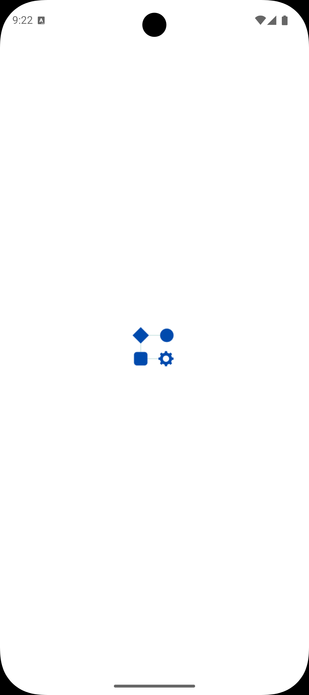
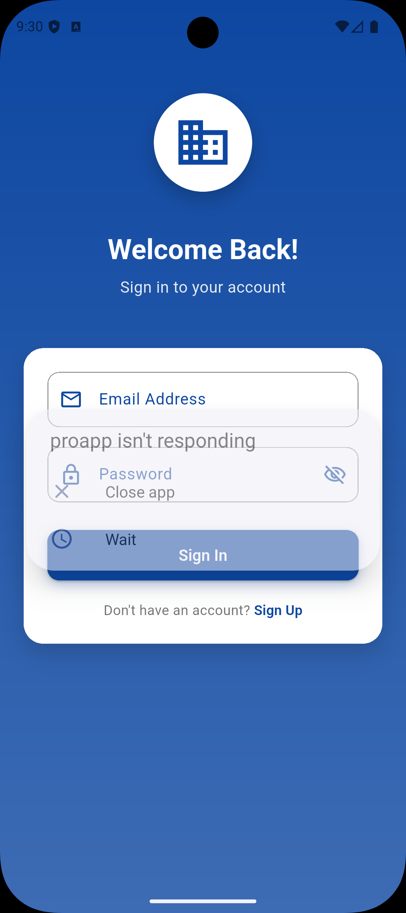
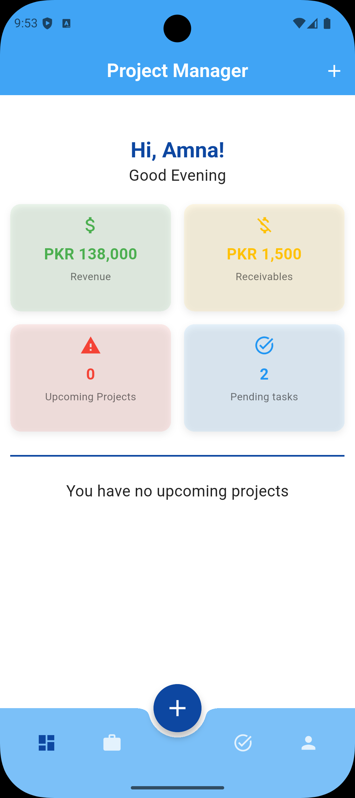
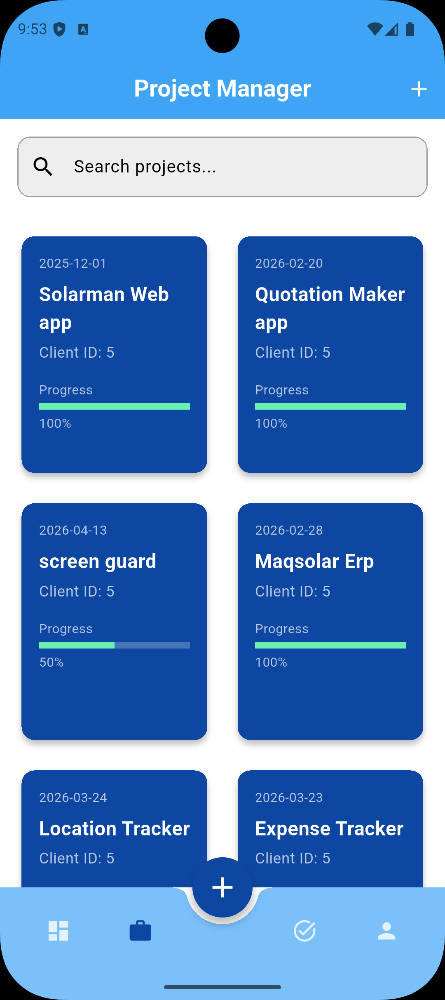
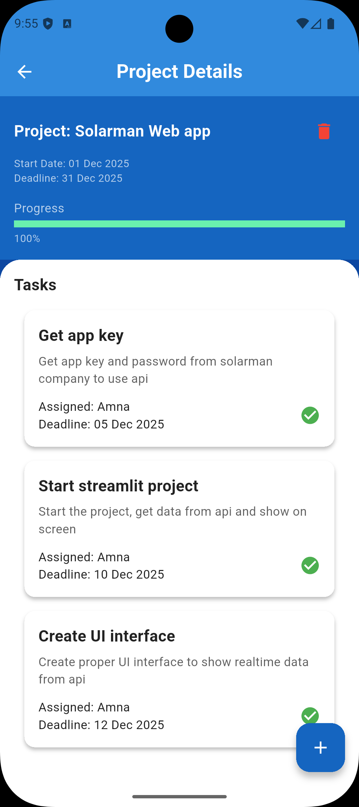
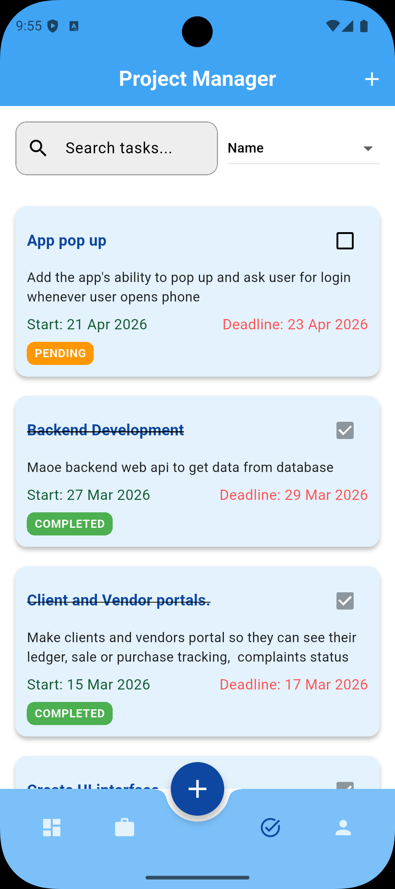

# ProApp - Project Management Application

A comprehensive Flutter-based project management application designed to streamline project tracking, task management, client relationships, and revenue monitoring. ProApp empowers teams to collaborate efficiently and stay on top of project deadlines.

## 🎯 Overview

ProApp is a full-featured project management solution built with Flutter, featuring real-time synchronization with a Node.js backend and SQL Server database. Whether you're managing multiple projects or tracking team productivity, ProApp provides the tools you need.

## ✨ Key Features

- **Project Management**: Create, update, and monitor project status with progress tracking
- **Task Management**: Assign tasks to team members and track completion status
- **Client Management**: Maintain client relationships and associate projects with clients
- **Revenue Tracking**: Keep accurate records of project revenue
- **Deadline Alerts**: Automatic notifications for approaching project deadlines
- **Team Collaboration**: Assign tasks to employees and manage team workload
- **Real-time Updates**: Live data synchronization with backend server

## 📸 App Screenshots

### Startup Screen

### Login Screen

### Dashboard

### Projects View

### Project Details

### Tasks Management

## 🏗️ Architecture & Project Structure

### main.dart
Defines the main application entry point, configures app theme, and handles navigation logic between login and home pages.

### services/ - API Integration
Contains API service classes that communicate with the Node.js backend to fetch and send data to the SQL Server database.

### provider/ - State Management
Implements Provider pattern for centralized state management, making data accessible across all pages without prop-drilling and separating business logic from UI.

**Key Providers:**
- `user.dart` - User authentication and profile management
- `projects.dart` - Project data management
- `client.dart` - Client data management

### models/ - Data Models
Data model classes representing application entities:
- `user_model.dart` - User entity
- `task.dart` - Task entity
- `pro_model.dart` - Project entity
- `profile.dart` - User profile entity

### pages/ - UI Screens
Contains all application screens with clean separation of concerns:
- `login.dart` - User authentication
- `home.dart` - Home dashboard
- `dashboard.dart` - Dashboard overview
- `add_pro.dart` - Create new projects
- `pro_detail.dart` - Project details view
- `tasks.dart` - Task management
- `task_add.dart` - Add new tasks
- `profile.dart` - User profile
- And more...

### widgets/ - Reusable Components
Shared UI components used across multiple screens:
- `dashboardCard.dart` - Dashboard card component
- `project_tile.dart` - Project list tile
- `task_tile.dart` - Task list tile

## 🔧 Technology Stack

- **Frontend**: Flutter (Dart)
- **State Management**: Provider
- **Backend**: Node.js
- **Database**: SQL Server
- **API Communication**: RESTful APIs

## 🚀 Core Functionality

✅ Create and manage multiple projects  
✅ Update project status and track progress  
✅ Create and assign tasks to team members  
✅ Edit and update task status  
✅ Manage client information  
✅ Associate projects with clients  
✅ Track revenue per project  
✅ Receive deadline alerts  

## 📦 Setup & Installation

1. Clone the repository
2. Navigate to the project directory
3. Run `flutter pub get` to install dependencies
4. Ensure Node.js backend is running
5. Configure API endpoints in `services/api_service.dart`
6. Run `flutter run` to launch the app

